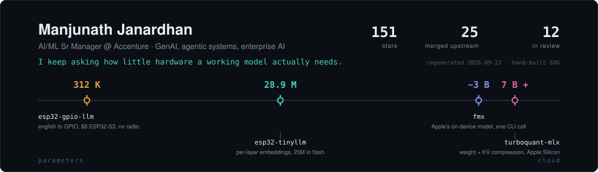
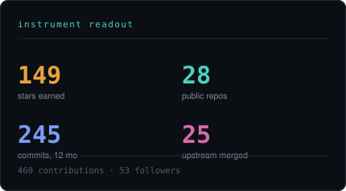
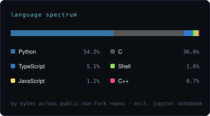
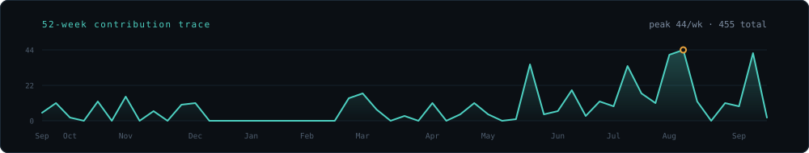

 

&nbsp;

 

I build agentic systems for enterprises by day, and spend my evenings finding out how little silicon a working model actually needs.

every card on this page is hand-built SVG, regenerated nightly from public GitHub data. no third-party widgets, no visitor counters.

---

## 01 · silicon

The through-line: take something that supposedly needs a datacenter, and land it on hardware you can hold.

<table>
  <tr>
    <td width="42%" valign="top">
      
      
    </td>
    <td width="58%" valign="top">

**[femtoclaw](https://github.com/manjunathshiva/femtoclaw)** · C 
The world's smallest AI agent. A full tool-calling loop in pure C on a \$4 ESP32, inside ~120 KB of RAM — no allocator games, no RTOS scheduler to hide behind.

**[turboquant-mlx](https://github.com/manjunathshiva/turboquant-mlx)** · Python 
MLX implementation of Google's TurboQuant: extreme weight *and* KV-cache compression for LLMs on Apple Silicon. The KV cache is the part everyone forgets, and it's what actually caps your context.

**[esp32-tinyllm](https://github.com/manjunathshiva/esp32-tinyllm)** · C 
28.9M parameters doing interactive storytelling on an \$8 ESP32-S3. Gemma-style per-layer embeddings keep 25M of those weights in flash, so the model outgrows the RAM it runs in.

**[esp32-gpio-llm](https://github.com/manjunathshiva/esp32-gpio-llm)** · Python 
312K parameters that turn plain English into GPIO commands. No WiFi, no cloud, no API key — the radio is off and it still works.

**[fmx](https://github.com/manjunathshiva/fmx)** · Python 
A friendly CLI for Apple's on-device Foundation Model — `fm chat` / `respond` / `schema` on macOS 26, today.

**[fastcontext](https://github.com/manjunathshiva/fastcontext)** · Python 
A preserved mirror of Microsoft's removed repo-exploration subagent ([arXiv 2606.14066](https://arxiv.org/abs/2606.14066)), patched to serve locally through `mlx-lm`. Research code shouldn't vanish because a repo got pulled.

</td>
  </tr>
</table>

## 02 · upstream

I go after the bugs that survive code review because everything still *looks* fine: a conversion boundary that silently drops a field. A good share of what's below is that same bug wearing different clothes — and each fix ships with the regression test that keeps it dead.

**merged — 18 upstream**

| project | what shipped | pr |
|---|---|---|
| **microsoft/agent-framework** | register built-in orchestration types so checkpoint restore stops failing | [#8258](https://github.com/microsoft/agent-framework/pull/8258) |
| **microsoft/agent-framework** | preserve tool call/result ordering when AG-UI splits a message | [#8005](https://github.com/microsoft/agent-framework/pull/8005) |
| **microsoft/agent-framework** | surface AG-UI workflow intermediate events as reasoning | [#8003](https://github.com/microsoft/agent-framework/pull/8003) |
| **microsoft/agent-framework** | keep parallel `function_result` contents through AG-UI conversion | [#7980](https://github.com/microsoft/agent-framework/pull/7980) |
| **microsoft/agent-framework** | forward `function_invocation_kwargs` from DevUI to the agent | [#7779](https://github.com/microsoft/agent-framework/pull/7779) |
| **microsoft/agent-framework** | stop dropping URL query parameters in the default HTTP request handler | [#7765](https://github.com/microsoft/agent-framework/pull/7765) |
| **microsoft/agent-framework** | preserve agent `additional_properties` when `HandoffBuilder` clones | [#7755](https://github.com/microsoft/agent-framework/pull/7755) |
| **langchain-ai/langchain** | default `GITLAB_URL` to gitlab.com instead of raising | [#14638](https://github.com/langchain-ai/langchain/pull/14638) |
| **NVIDIA/GenerativeAIExamples** | fix the `ModelFilter` ImportError that broke the examples on new `huggingface_hub` | [#208](https://github.com/NVIDIA/GenerativeAIExamples/pull/208) |
| **PrismML-Eng/Bonsai** | auto-fall back to MLX when a GGUF build is absent, instead of dying | [#123](https://github.com/PrismML-Eng/Bonsai-demo/pull/123) · [#126](https://github.com/PrismML-Eng/Bonsai-demo/pull/126) |
| **neo4j-graphacademy** | fix the wrong `fulltext_index_name` in the GraphRAG hybrid retriever | [#6](https://github.com/neo4j-graphacademy/genai-workshop-graphrag/pull/6) |

plus six smaller docs, README and dependency fixes across <a href="https://github.com/NVIDIA/GenerativeAIExamples/pulls?q=is%3Apr+author%3Amanjunathshiva">NVIDIA/GenerativeAIExamples</a>, <a href="https://github.com/collabnix/dockerbangalore/pull/68">collabnix</a> and <a href="https://github.com/pulls?q=is%3Apr+author%3Amanjunathshiva+org%3AAIAnytime">AIAnytime</a>.

**in review — 14 signals out**

| project | what i shipped | pr |
|---|---|---|
| **microsoft/agent-framework** | keep cached + reasoning token counts through Foundry hosting | [#8334](https://github.com/microsoft/agent-framework/pull/8334) |
| **microsoft/agent-framework** | keep agent compaction config when `HandoffBuilder` clones participants | [#8329](https://github.com/microsoft/agent-framework/pull/8329) |
| **microsoft/agent-framework** | parse Responses `function_call_output` so hosted tool results survive | [#8078](https://github.com/microsoft/agent-framework/pull/8078) |
| **microsoft/agent-framework** | keep AG-UI workflow reasoning in thread snapshots | [#8058](https://github.com/microsoft/agent-framework/pull/8058) |
| **microsoft/agent-framework** | make concurrent `FileCheckpointStorage` saves stop racing | [#7757](https://github.com/microsoft/agent-framework/pull/7757) |
| **microsoft/agent-framework** | validate declarative message properties; tighten strict skill script schemas | [#8119](https://github.com/microsoft/agent-framework/pull/8119) · [#8120](https://github.com/microsoft/agent-framework/pull/8120) |
| **google-research/tabfm** | cast float64 targets before the device move; ship the `safetensors` extra | [#74](https://github.com/google-research/tabfm/pull/74) · [#75](https://github.com/google-research/tabfm/pull/75) |
| **MicrosoftDocs/azure-ai-docs** | clarify declarative workflow response events | [#838](https://github.com/MicrosoftDocs/azure-ai-docs/pull/838) |
| **ibm-self-serve-assets/SuperKnowa** | repair the PDF retriever notebooks | [#22](https://github.com/ibm-self-serve-assets/SuperKnowa/pull/22) · [#23](https://github.com/ibm-self-serve-assets/SuperKnowa/pull/23) |

## 03 · bench

## 04 · what i tell teams

- **Run it on the smallest thing that works.** A constraint you can't argue with is the fastest way to find out what your architecture actually needs.
- **The bug is usually at a boundary.** Serialize, clone, convert, forward — that's where fields go missing, and where tests rarely look.
- **A fix without a regression test is a rumour.** It'll come back under a new issue number.
- **Design patterns didn't stop mattering because the component is now a model.** Agentic systems fail in ways software engineering already has names for.

## 05 · talks & workshops

Speaker and workshop author — sessions on agentic AI, MCP, and graph-backed retrieval, with the material kept public rather than locked in a slide deck.

[aidevcon 2026](https://github.com/manjunathshiva/aidevcon2026) · [PyData 2025](https://github.com/manjunathshiva/PyData2025) · [Neo4j OSS 2025](https://github.com/manjunathshiva/neo4j-workshop-2025) · [Agentic AI + MCP](https://github.com/manjunathshiva/agentic_ai_mcp_workshop) · [ADK + MCP](https://github.com/manjunathshiva/adk_mcp_workshop) · [DevFest Noida](https://github.com/manjunathshiva/devfestnoida) · [AWS Community Day Mumbai](https://github.com/manjunathshiva/awscdaymumbai)

## 06 · reach me

Bring me something that isn't supposed to fit.

